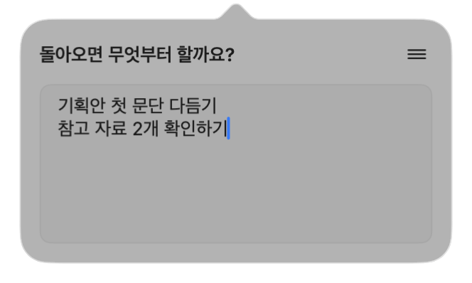

<p align="center">
  
</p>

# BookmarkPet

**다음 할 일을 남기고, 돌아와서 이어가세요.**

다음 작업을 위한 메모 한 개를 보관하는 작은 macOS 메뉴바 앱입니다. 맥을 덮기 전에 짧게 남겨두고, 돌아오면 책갈피 펫을 눌러 작업을 이어가세요.

[English](README.md) · **한국어**

[v0.1.0 다운로드](https://github.com/S4lmon-SH/BookmarkPet/releases/tag/v0.1.0) · [버그 제보](https://github.com/S4lmon-SH/BookmarkPet/issues) · [MIT 라이선스](LICENSE)

<p align="center">
  
</p>

## 이렇게 사용하세요

1. 메뉴바의 책갈피 펫을 누릅니다.
2. “돌아오면 무엇부터 할까요?” 아래에 다음 할 일을 적습니다. 입력할 때마다 자동 저장됩니다.
3. 팝오버를 닫거나 앱을 종료해도 메모는 맥에 남습니다.
4. 돌아와서 펫을 누르고 작업을 이어갑니다.

작은 **!** 배지는 기다리는 메모가 있다는 뜻입니다. 메모를 비우면 사라지고, **되돌리기**를 누르면 본문과 함께 복원됩니다. 공백과 줄바꿈만 있으면 배지를 표시하지 않지만, 입력한 공백과 줄바꿈 자체는 그대로 보존합니다.

## 주요 기능

- 메모 한 개를 로컬에 자동 저장하고 앱 재실행 시 복원합니다.
- 직접 그린 책갈피 캐릭터와 폭이 일정한 메뉴바 아이콘을 사용합니다.
- 가로 304pt의 작은 팝오버가 열리면 바로 입력할 수 있고, 긴 메모는 스크롤할 수 있습니다.
- 한글·여러 줄·붙여넣기와 기본 Command 단축키를 지원하는 네이티브 편집기입니다.
- 오른쪽 위 **☰** 메뉴에 **메모 비우기**, **되돌리기**, **로그인 시 실행**, **종료**를 모았습니다.
- 바깥 클릭이나 Escape로 닫습니다. 설정 메뉴를 연 뒤 바깥을 클릭해도 함께 닫힙니다.
- 라이트·다크 모드, Retina 화면, 모션 줄이기 설정에 대응합니다.
- Dock 아이콘, 계정, 클라우드 동기화, 분석 정보 수집, 외부 패키지가 없습니다.

앱의 화면 언어는 현재 **한국어**입니다.

## 다운로드와 설치

**macOS 13 Ventura 이상**이 필요합니다. 배포 파일은 Apple Silicon과 Intel 실행 파일을 함께 포함한 유니버설 앱입니다.

1. [Releases](https://github.com/S4lmon-SH/BookmarkPet/releases/tag/v0.1.0)에서 `BookmarkPet-0.1.0-universal.zip`을 다운로드합니다.
2. 압축을 풀고 `BookmarkPet.app`을 `/Applications` 또는 `~/Applications`로 옮깁니다.
3. 앱을 실행하고 메뉴바에서 책갈피 펫을 찾습니다. Dock 아이콘은 나타나지 않습니다.

### 처음 실행할 때의 보안 안내

v0.1.0은 임시 서명만 적용한 **실험적인 개발 버전**이며, **Apple 공증을 받지 않았습니다**. macOS가 첫 실행을 차단할 수 있습니다. 다운로드를 신뢰한다면 [Apple의 안내](https://support.apple.com/ko-kr/102445)에 따라 실행을 한 번 시도한 뒤 **시스템 설정 → 개인정보 보호 및 보안 → 그래도 열기**를 사용할 수 있습니다. 해당 버튼의 제공 여부는 시스템 설정에 따라 다를 수 있습니다. 아래 방법으로 소스에서 직접 빌드할 수도 있습니다.

릴리스에 `SHA256SUMS.txt`도 제공합니다. 압축 파일과 같은 폴더에 두고 다음 명령으로 다운로드 파일을 확인할 수 있습니다.

```sh
shasum -a 256 -c SHA256SUMS.txt
```

## 설정과 단축키

안내 문구 오른쪽의 **☰**를 누릅니다.

| 메뉴 | 동작 |
| --- | --- |
| 메모 비우기 | 메모와 배지를 비웁니다. |
| 되돌리기 | 직전 비우기를 취소합니다. 다음 입력이나 앱 종료 전까지 사용할 수 있습니다. |
| 로그인 시 실행 | 로그인 시 자동 실행 등록을 켜거나 끕니다. |
| 로그인 항목 설정 열기 | 시스템 승인이 필요할 때 해당 설정을 엽니다. |
| BookmarkPet 종료 | 메모를 보존하고 앱을 종료합니다. |

편집기에서 **⌘V** 붙여넣기, **⌘C** 복사, **⌘X** 잘라내기, **⌘A** 전체 선택, **⌘Z** 실행 취소, **⇧⌘Z** 다시 실행을 사용할 수 있습니다. 입력기 조합 중이 아닐 때 Escape를 누르면 팝오버가 닫힙니다.

### 로그인 시 실행

앱을 고정된 위치에 설치한 뒤 설정을 켜세요. `SMAppService.mainApp`으로 등록하며, macOS의 실제 등록 상태를 읽습니다. 시스템 승인이 필요하면 메뉴에 안내와 설정 열기 항목이 나타납니다.

로그인 후에는 저장된 메모의 배지와 함께 메뉴바에서 조용히 대기하고, 팝오버를 자동으로 열지 않습니다. 앱을 이동하거나 새 빌드로 교체한 뒤 자동 실행이 멈췄다면 토글을 껐다가 다시 켜세요.

## 메모 저장과 개인정보

메모는 다음 위치의 **UTF-8 일반 텍스트 파일**로 저장합니다.

```text
~/Library/Application Support/BookmarkPet/memo.txt
```

입력할 때마다 파일을 원자적으로 교체하며, 저장 본문을 잘라내거나 정규화하지 않습니다. 배지 표시 여부만 공백·줄바꿈을 제외한 내용으로 판단합니다. 메모를 전송하거나 분석 정보를 수집하지 않으며, BookmarkPet 자체에서 파일을 암호화하지는 않습니다.

앱을 종료하거나 삭제해도 이 파일은 남습니다. 저장된 메모까지 완전히 삭제하려면 앱을 종료하고 해당 파일을 삭제하세요. 비우기 되돌리기 기록은 메모리에만 보관합니다.

## 소스에서 빌드하기

Xcode 또는 Apple Command Line Tools의 **Swift 6 도구 체인**이 필요합니다. 외부 의존성은 없습니다.

```sh
git clone https://github.com/S4lmon-SH/BookmarkPet.git
cd BookmarkPet
./scripts/test.sh
./scripts/build.sh
open ./build/BookmarkPet.app
```

기본 빌드는 현재 Mac의 아키텍처로 컴파일하며 최소 실행 버전을 macOS 13으로 지정합니다. 앱 번들, 아이콘, `Info.plist`, 임시 서명을 함께 생성합니다. 일반 사용과 로그인 항목 등록에는 `swift run` 대신 생성된 `.app`을 실행하세요.

배포용 유니버설 앱과 ZIP 파일을 만들려면 다음을 실행합니다.

```sh
./scripts/test.sh
./scripts/package.sh
```

결과물은 `build/release/BookmarkPet-0.1.0-universal.zip`과 `SHA256SUMS.txt`입니다. 빌드 결과물은 Git에서 제외합니다.

사용자별 응용 프로그램 폴더에 설치할 수도 있습니다.

```sh
mkdir -p "$HOME/Applications"
ditto ./build/BookmarkPet.app "$HOME/Applications/BookmarkPet.app"
open "$HOME/Applications/BookmarkPet.app"
```

기존 앱을 교체하기 전에는 실행 중인 앱을 종료하세요.

## 소스 구성

| 경로 | 역할 |
| --- | --- |
| `Sources/BookmarkPetCore/MemoSession.swift` | 파일 저장, 메모 상태, 비우기와 되돌리기 |
| `Sources/BookmarkPet/BookmarkPetApp.swift` | SwiftUI 팝오버, AppKit 편집기, 메뉴바 그림, 로그인 항목 |
| `Resources/BookmarkPet.svg` | 책갈피 캐릭터의 원본 벡터 그림 |
| `scripts/make_icon.swift` | 네이티브 앱 아이콘 생성 |
| `scripts/build.sh` / `scripts/package.sh` | 현재 Mac 또는 유니버설 빌드와 배포 파일 생성 |
| `scripts/test.sh` / `Tests/` | 핵심 테스트와 독립 테스트 러너 |

`Package.swift`에는 `swift test`용 Swift Testing 테스트도 포함되어 있습니다. 독립 테스트 러너는 개발 Mac에서 발견한 SwiftPM 프레임워크 로딩 문제를 우회합니다.

## 검증과 제한 사항

자세한 결과와 수동 절차는 [검증 문서](docs/VERIFICATION.md#한국어)를 참고하세요. Apple Silicon Mac에서 저장·복원·공백 판정·비우기·되돌리기·클립보드 붙여넣기와 실제 메뉴바 UI를 확인했습니다.

- Intel 실행 파일은 크로스 컴파일했으며 Intel Mac에서 실행하지는 않았습니다.
- macOS 13을 최소 버전으로 지정했지만 실제 macOS 13 환경에서 시험하지는 않았습니다.
- 재부팅·재로그인, 잠자기·복귀, 화면 잠금·해제, 실제 한글 입력기의 조합 과정은 문서의 수동 확인이 필요합니다.
- 현재 버전은 Developer ID 서명, Apple 공증, 자동 업데이트, 영어 앱 UI를 제공하지 않습니다.

## 의견과 라이선스

버그나 작은 개선 아이디어가 있다면 macOS 버전과 재현 방법을 포함해 [이슈를 남겨주세요](https://github.com/S4lmon-SH/BookmarkPet/issues). 개인 메모 내용은 제외해주세요.

BookmarkPet이 작업을 이어가는 데 도움이 되었다면 GitHub Star로 응원해주세요.

[MIT 라이선스](LICENSE)로 공개합니다. Copyright © 2026 S4lmon.
